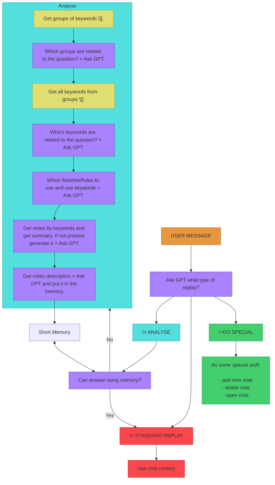

```mermaid
graph TB
subgraph ab7778a2d708eb0f["Analyse"]
207a7feca601c2e2["Which MatcherRules to use and use keywords > Ask GPT."]
78e957bda4884a41["Get groups of keywords \[]."]
f755572270f4b40b["Which groups are related to the question? > Ask GPT."]
223a839673882ebc["Get all keywords from groups \[]."]
876ae3132c378cae["Which keywords are related to the question? > Ask GPT."]
c5eacc9b622b4c0a["Get notes by keywords and get summary. If not present generate it > Ask GPT."]
76f53107dccbc61b["Get notes description > Ask GPT and put it in the memory."]

end
2e78d5081acb9130["\> ANALYSE"]
03c0bf2d7d53ba30["Ask GPT what type of replay?"]
5e4aff86d5515375["USER MESSAGE"]
b6f82d11aa769a1f["Can answer using memory?"]
0ae8cee0a7cf4f85["Short Memory"]
207a7feca601c2e2["Which MatcherRules to use and use keywords > Ask GPT."]
78e957bda4884a41["Get groups of keywords \[]."]
f755572270f4b40b["Which groups are related to the question? > Ask GPT."]
223a839673882ebc["Get all keywords from groups \[]."]
876ae3132c378cae["Which keywords are related to the question? > Ask GPT."]
c5eacc9b622b4c0a["Get notes by keywords and get summary. If not present generate it > Ask GPT."]
76f53107dccbc61b["Get notes description > Ask GPT and put it in the memory."]
e5a6cbc4df30ca71["\>DO SPECIAL"]
4f6683862d28ae89["\> STANDARD REPLAY"]
e0655c30dc3992a5["Use chat context"]
06a04622a782b489["do some special stuff:

- add new note
- delete note
- open note"]
2e78d5081acb9130 --> b6f82d11aa769a1f
f755572270f4b40b --> 223a839673882ebc
223a839673882ebc --> 876ae3132c378cae
876ae3132c378cae --> 207a7feca601c2e2
207a7feca601c2e2 --> c5eacc9b622b4c0a
c5eacc9b622b4c0a --> 76f53107dccbc61b
e5a6cbc4df30ca71 --> 06a04622a782b489
b6f82d11aa769a1f --> |Yes| 4f6683862d28ae89
78e957bda4884a41 --> f755572270f4b40b
b6f82d11aa769a1f --> |No
| ab7778a2d708eb0f
4f6683862d28ae89 --> e0655c30dc3992a5
5e4aff86d5515375 --> 03c0bf2d7d53ba30
03c0bf2d7d53ba30 --> 2e78d5081acb9130
03c0bf2d7d53ba30 --> 4f6683862d28ae89
03c0bf2d7d53ba30 --> e5a6cbc4df30ca71
76f53107dccbc61b --> 0ae8cee0a7cf4f85
0ae8cee0a7cf4f85 <--> b6f82d11aa769a1f
style ab7778a2d708eb0f fill:#53dfdd, stroke:#20acaa
style 207a7feca601c2e2 fill:#a882ff, stroke:#754fcc
style 78e957bda4884a41 fill:#e0de71, stroke:#adab3e
style f755572270f4b40b fill:#a882ff, stroke:#754fcc
style 223a839673882ebc fill:#e0de71, stroke:#adab3e
style 876ae3132c378cae fill:#a882ff, stroke:#754fcc
style c5eacc9b622b4c0a fill:#a882ff, stroke:#754fcc
style 76f53107dccbc61b fill:#a882ff, stroke:#754fcc
style 2e78d5081acb9130 fill:#53dfdd, stroke:#20acaa
style 03c0bf2d7d53ba30 fill:#a882ff, stroke:#754fcc
style 5e4aff86d5515375 fill:#e9973f, stroke:#b6640c
style b6f82d11aa769a1f fill:#a882ff, stroke:#754fcc
style 207a7feca601c2e2 fill:#a882ff, stroke:#754fcc
style 78e957bda4884a41 fill:#e0de71, stroke:#adab3e
style f755572270f4b40b fill:#a882ff, stroke:#754fcc
style 223a839673882ebc fill:#e0de71, stroke:#adab3e
style 876ae3132c378cae fill:#a882ff, stroke:#754fcc
style c5eacc9b622b4c0a fill:#a882ff, stroke:#754fcc
style 76f53107dccbc61b fill:#a882ff, stroke:#754fcc
style e5a6cbc4df30ca71 fill:#44cf6e, stroke:#119c3b
style 4f6683862d28ae89 fill:#fb464c, stroke:#c81319
style e0655c30dc3992a5 fill:#fb464c, stroke:#c81319
style 06a04622a782b489 fill:#44cf6e, stroke:#119c3b
```